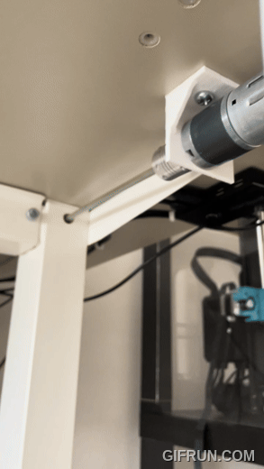
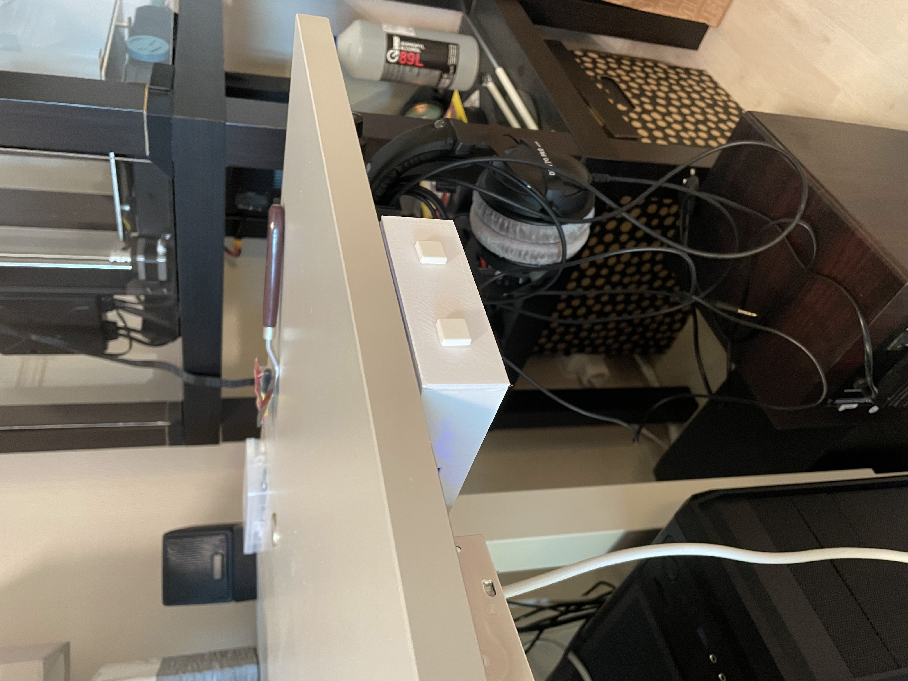

# Motor Control with Wemos D1 Mini

   
   
   

This project is designed to control a motor using the Wemos D1 Mini, with buttons to move the motor forward and backward. The setup is designed to be fault-tolerant, preventing the motor from running indefinitely.

This project is designed to control a motor using the Wemos D1 Mini, with buttons to move the motor forward and backward. The setup is designed to be fault-tolerant, preventing the motor from running indefinitely.

## Features

- **Button Control:** Two buttons control the motor's direction (forward and backward).
- **PWM Speed Control:** Motor speed is controlled using PWM, increasing speed the longer a button is held.
- **Safety Timeout:** The motor will stop automatically if it runs for more than 30 seconds continuously.
- **Status Indicator:** Built-in LED indicates the motor's running status.
- **Debouncing:** Small delay added to avoid button bouncing issues.

## Components

- Wemos D1 Mini (ESP-8266)
- Two buttons: TACTS-12x12x7.3
- Motor: 36GP-555 High Torque Low Noise DC 12V 24V Planetary Gear Motor
- Flexible Coupler 6x7 mm
- H bridge for motor driving: BTS7960 DC 43A Stepper Motor Driver Module
- Power supply for the motor and ESP-8266: 100W 24V Switching power supply
- Step-down DC-DC converter for ESP-8266: LM2596 Buck Converter
- 3D printed "electronics case"

## Pin Configuration

| Component     | Wemos D1 Mini Pin |
|---------------|-------------------|
| Button 1      | D1 (GPIO5)        |
| Button 2      | D2 (GPIO4)        |
| Motor Enable R| D3 (GPIO0)        |
| Motor Enable L| D4 (GPIO2)        |
| Motor PWM R   | D5 (GPIO14)       |
| Motor PWM L   | D6 (GPIO12)       |
| Status LED    | LED_BUILTIN       |

